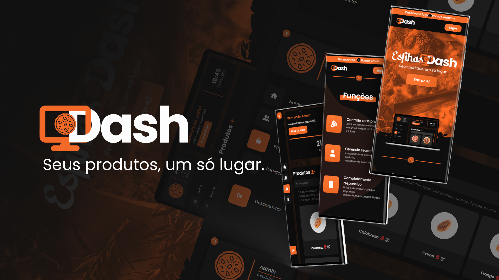

    

    
    
         
    
<b>BR</b>: "EsfihasDash" é um sistema de gerenciamento de clientes, pedidos e produtos, baseado em uma aplicação CRUD. / <b>EN</b>: "EsfihasDash", a CRUD based application that can manage clients, orders and products as a webapp.
           
    <h3><b><a href='https://esfihasdash.vercel.app'>>>Avaliable here<<<a></b></h3>

    
    

